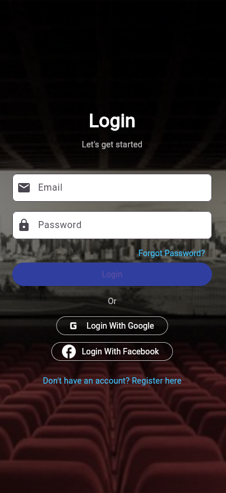
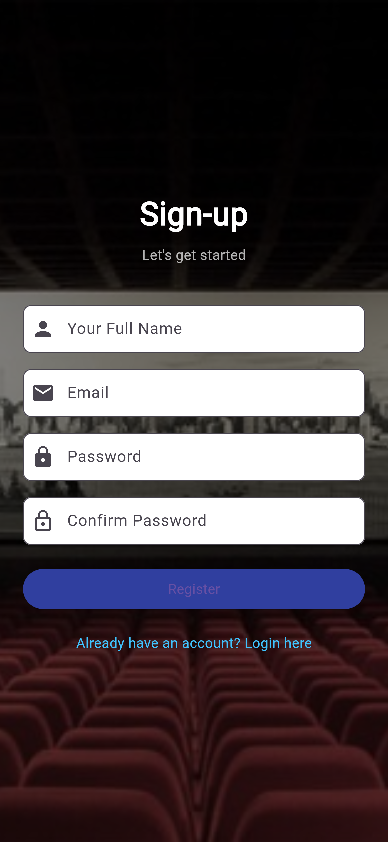
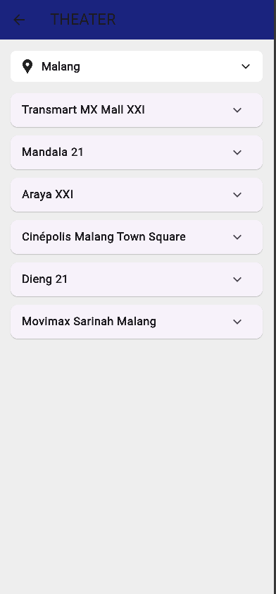

# 🎬 Aplikasi Pemesanan Tiket Bioskop - Assignment 2

Proyek ini merupakan tugas **Pemrograman Mobile (Flutter)** yang dikembangkan secara manual tanpa bantuan AI.  
Aplikasi ini menampilkan tiga halaman utama yang berfokus pada proses **autentikasi pengguna** dan **informasi bioskop berdasarkan lokasi**.

---

## 🚀 Fitur Utama

### 🧾 1. Halaman Login
- Pengguna dapat masuk menggunakan email dan password.  
- Tersedia tombol **“Forgot Password”**, serta opsi **Login dengan Google dan Facebook**.  
- Tombol navigasi ke halaman pendaftaran jika belum memiliki akun.

### 📝 2. Halaman Sign-up
- Pengguna baru dapat mendaftar dengan mengisi nama lengkap, email, dan password.  
- Tersedia konfirmasi password untuk keamanan.  
- Tombol “Register” akan mengarahkan kembali ke halaman login.

### 🎭 3. Halaman Theater (User Profile / Keranjang)
- Menampilkan daftar bioskop berdasarkan **lokasi pengguna (geolocator)**.  
- Lokasi ditampilkan secara otomatis, misalnya “Malang”.  
- Daftar bioskop terdiri dari:
  - Transmart MX Mall XXI
  - Mandala 21  
  - Araya XXI
  - Cinépolis Malang Town Square
  - Dieng 21
  - Movimax Sarinah Malang  

---

## 🛠️ Teknologi yang Digunakan

- **Flutter SDK**  
- **Dart Language**  
- **Geolocator Package** untuk mendapatkan lokasi pengguna  
- **Material Design Components**  

---

## 📂 Struktur Folder

```
lib/
 ├── main.dart
 ├── pages/
 │    ├── login_page.dart
 │    ├── signup_page.dart
 │    └── theater_page.dart
 └── widgets/
      └── theater_item.dart
assets/
 └── bg.jpeg
```

---

## 🧭 Cara Menjalankan Proyek

1. Clone repository ini  
   ```bash
   git clone https://github.com/novaa244/CInema-Malang.git
   cd tugas_lms3
   ```

2. Install dependency  
   ```bash
   flutter pub get
   ```

3. Jalankan aplikasi  
   ```bash
   flutter run
   ```

> Pastikan Android SDK dan NDK sudah terpasang dengan benar pada sistem kamu.

---

## 📸 Tampilan Aplikasi

| Login Page | Sign-Up Page | Theater Page |
|-------------|---------------|--------------|
|  |  |  |


---

## 👨‍💻 Pengembang

**Nama:** Dianda Naufal Rahmanda  
**Mata Kuliah:** Pemrograman Mobile  
**Dosen Pengampu:** Bashor Fauzan Muthohirin, S.Kom., M.Kom  
**Kampus:** Universitas Muhammadiyah Malang

---

## 📜 Lisensi

MIT License  
Copyright (c) 2025 **Dianda Naufal Rahmanda**

Permission is hereby granted, free of charge, to any person obtaining a copy  
of this software and associated documentation files (the “Software”), to deal  
in the Software without restriction, including without limitation the rights  
to use, copy, modify, merge, publish, distribute, sublicense, and/or sell  
copies of the Software, and to permit persons to whom the Software is  
furnished to do so, subject to the following conditions:

The above copyright notice and this permission notice shall be included in  
all copies or substantial portions of the Software.

THE SOFTWARE IS PROVIDED “AS IS”, WITHOUT WARRANTY OF ANY KIND, EXPRESS OR  
IMPLIED, INCLUDING BUT NOT LIMITED TO THE WARRANTIES OF MERCHANTABILITY,  
FITNESS FOR A PARTICULAR PURPOSE AND NONINFRINGEMENT. IN NO EVENT SHALL THE  
AUTHORS OR COPYRIGHT HOLDERS BE LIABLE FOR ANY CLAIM, DAMAGES OR OTHER  
LIABILITY, WHETHER IN AN ACTION OF CONTRACT, TORT OR OTHERWISE, ARISING FROM,  
OUT OF OR IN CONNECTION WITH THE SOFTWARE OR THE USE OR OTHER DEALINGS IN  
THE SOFTWARE.

---

## 🏷️ Keterangan
Proyek ini dibuat untuk keperluan pembelajaran dan tugas akademik.  
Dilarang memperjualbelikan atau mendistribusikan ulang tanpa izin pengembang asli.
